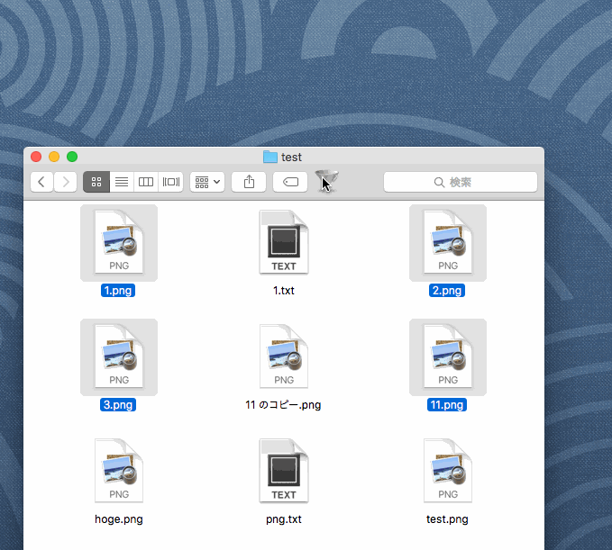

#PoorSelect

##About

PoorSelect find items which match with specified condition at selected location in Finder , and select them.(This is inspired by PowerSelect)

##Usage

- Add Finder Toolbar
- Use from LaunchBar or Alfred.

Example

- ^[0-9]
- png$
- -d txt
- -i hoge
- hoge | grep fuga
- e hoge -e fuga

##Download

Click Here → [Download](https://github.com/veadar/PoorSelect/releases)

##Special Thanks & Used Codes

- <a href="http://www.script-factory.net/software/FinderHelpers/PowerSelect/">PowerSelect</a>
- <a href="http://memogakisouko.appspot.com/MenuBarAppleScript.html">MenuBarAppleScript</a>
- [IconEden
](https://www.iconfinder.com/icons/61494/30_filter_icon)
- [sed・grepで濁点と改行をまともに扱う方法](http://d.hatena.ne.jp/zariganitosh/20100930/sed_grep_cr_lf_utf8_mac)